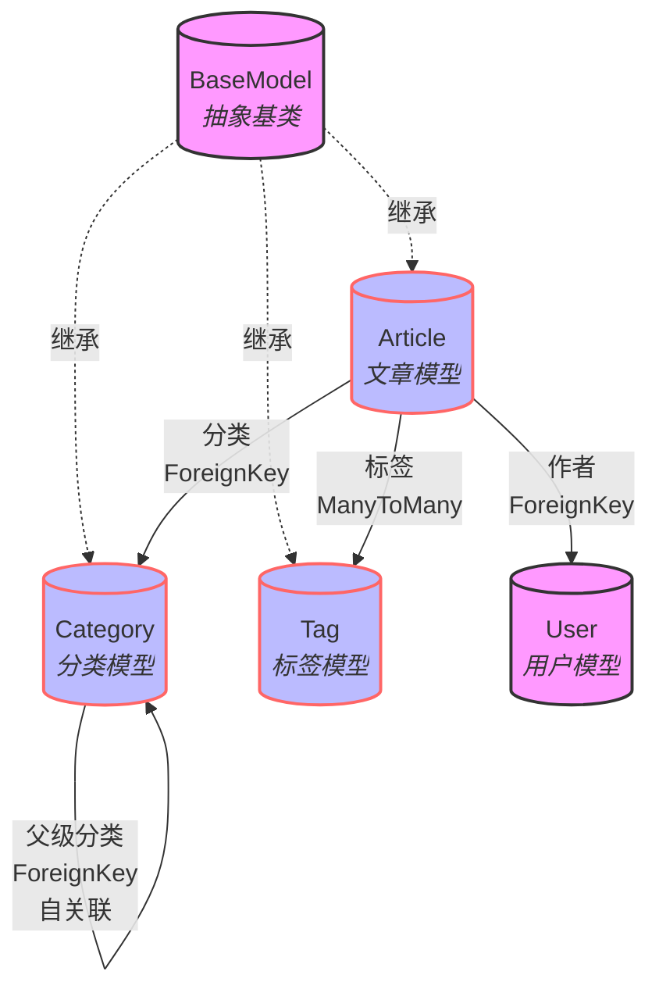
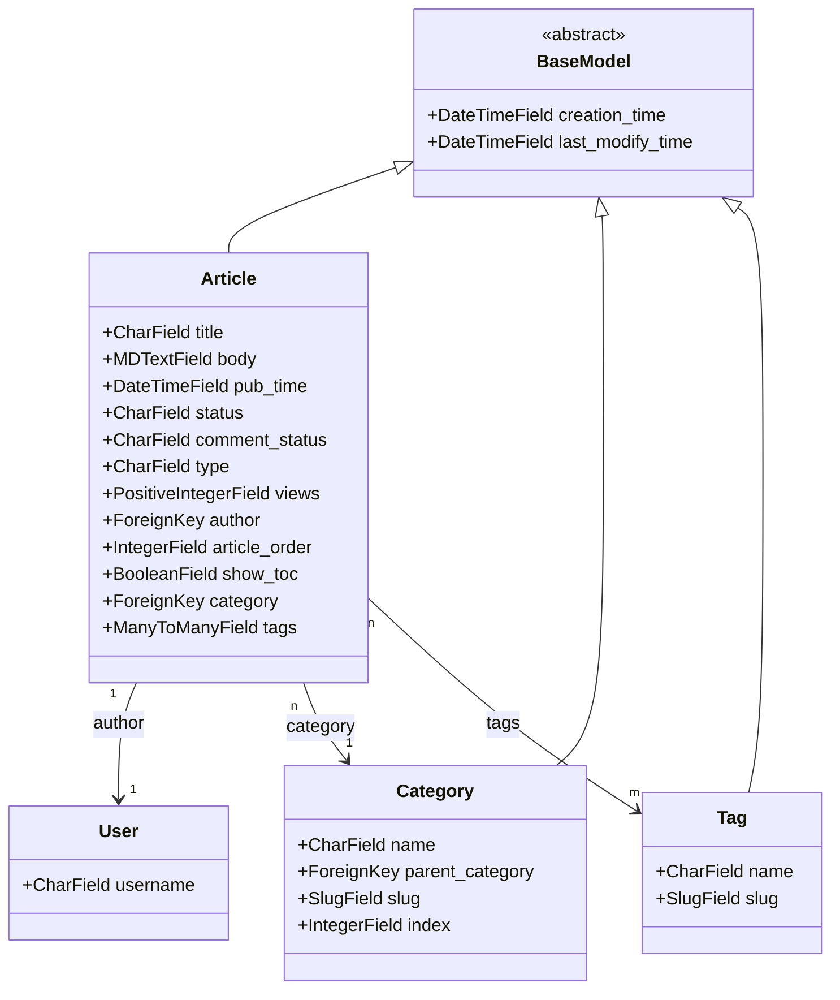

# 1.博客文章 -- 模型


```
博客处理中最麻烦的事就是 模型表的建立  

高效的模型会提升我们各项操作处理的逻辑关系，使得性能和可扩展性得到提升
```




```
BaseModel: 作为一个抽象基类，BaseModel 为所有其他模型提供了统一的时间戳字段（创建时间和修改时间）。它不直接映射到数据库表中，而是被其他模型继承。

Article: 这是文章模型，包含文章的主要信息如标题、内容等。它直接与以下模型相关联：

User: 通过 ForeignKey 关联到 User，表示文章的作者。
Category: 通过 ForeignKey 关联到 Category，表示文章所属的分类。
Tag: 通过 ManyToMany 关系关联多个 Tag，表示文章的标签。
Category: 表示文章的分类。它可以有层级结构，允许分类具有父级分类（通过 ForeignKey 自关联实现）。

Tag: 用于标记文章的关键词或主题，可以与多篇文章关联。
```


```python
from django.db import models
from django.utils.timezone import now
from django.utils.translation import gettext_lazy as _
from django.conf import settings
# markdown编辑器  pip install Markdown django-mdeditor
# 还需setting注册应用mdeditor
from mdeditor.fields import MDTextField

# 基础模型
class BaseModel(models.Model):
    creation_time = models.DateTimeField(_('创建时间'), auto_now_add=True)
    last_modify_time = models.DateTimeField(_('修改时间'), auto_now=True)

    class Meta:
        abstract = True
        get_latest_by = 'creation_time'


# 文章模型
class Article(BaseModel):
    STATUS_CHOICES = (
        ('d', _('草稿')),
        ('p', _('发布')),
    )
    COMMENT_STATUS = (
        ('o', _('打开')),
        ('c', _('关闭')),
    )
    TYPE = (
        ('a', _('常规文章')),
        ('p', _('导航置顶')),
    )
    title = models.CharField(_('标题'), max_length=200, unique=True)
    body = MDTextField(_('内容'))
    pub_time = models.DateTimeField(_('发布时间'), default=now)
    status = models.CharField(_('状态'), max_length=1, choices=STATUS_CHOICES, default='p')
    comment_status = models.CharField(_('评论状态'), max_length=1, choices=COMMENT_STATUS, default='o')
    type = models.CharField(_('分类'), max_length=1, choices=TYPE, default='a')
    views = models.PositiveIntegerField(_('观看人数'), default=0)
    author = models.ForeignKey(settings.AUTH_USER_MODEL, verbose_name=_('作者'), on_delete=models.CASCADE)
    article_order = models.IntegerField(_('文章顺序'), default=0)
    show_toc = models.BooleanField(_('显示目录'), default=False)
    category = models.ForeignKey('Category', verbose_name=_('文章类型'), on_delete=models.CASCADE)
    tags = models.ManyToManyField('Tag', verbose_name=_('标签'), blank=True)

    class Meta:
        ordering = ['-article_order', '-pub_time']
        verbose_name = _('文章')
        verbose_name_plural = verbose_name

    def __str__(self):
        return self.title


# 分类模型
class Category(BaseModel):
    name = models.CharField(_('分类名称'), max_length=30, unique=True)
    parent_category = models.ForeignKey('self', verbose_name=_('上一级'), on_delete=models.CASCADE, null=True, blank=True)
    slug = models.SlugField(default='no-slug', max_length=60)
    index = models.IntegerField(default=0, verbose_name=_('索引'))  # _('index'))

    class Meta:
        ordering = ['-index']
        verbose_name = _('分类')
        verbose_name_plural = verbose_name

    def __str__(self):
        return self.name


# 标签模型
class Tag(BaseModel):
    name = models.CharField(_('标签名称'), max_length=30, unique=True)
    slug = models.SlugField(default='no-slug', max_length=60)

    class Meta:
        ordering = ['name']
        verbose_name = _('标签')
        verbose_name_plural = verbose_name

    def __str__(self):
        return self.name

```

```
我们专业的博客文章其编辑器均采用 markdown编辑器，因此我们的模型字段需要操作MDTextField字段

pip install django-mdeditor

MDTextField 来自 django-mdeditor 包，这是一个用于 Django 应用的 Markdown 编辑器插件。它提供了一个基于 Markdown 编辑器的 Django 表单字段，允许在 Django 的 admin 界面或者自定义的 Django 表单中编辑 Markdown 文本。

还需setting注册应用mdeditor
```



```
BaseModel: 一个抽象基类，提供了创建和修改时间的通用字段。它是其他所有模型的基础。

Article: 描述一篇文章的模型。它包括文章的标题、内容（Markdown格式）、发布时间、状态、评论状态、类型、观看人数、作者、文章顺序、是否显示目录、所属分类和标签。
	与 User 通过 author 字段关联（一对一）。
	与 Category 通过 category 字段关联（多对一）。
	与 Tag 通过 tags 字段关联（多对多）。
	
Category: 表示文章的分类。它包括分类名称、上一级分类（自关联）、URL的 slug 和索引。分类可以有层级结构。

Tag: 代表文章的标签，每个标签有一个名称和 URL slug。

slug字段是方便seo（可以提高页面在搜索引擎中的排名） --- 通常包含字母、数字和连字符（破折号），用于替代传统 URL 中的数字 ID。
----- 我是帅哥 --- slug: wo-shi-shuai-ge
```


# 2.后台管理

```python
# article_blog/admin.py

from django.contrib import admin
from .models import Article, Category, Tag
# Register your models here.


admin.site.register(Article)
admin.site.register(Category)
admin.site.register(Tag)

```


```python
# article_blog/apps.py

from django.apps import AppConfig


class ArticleBlogConfig(AppConfig):
    default_auto_field = 'django.db.models.BigAutoField'
    name = 'article_blog'
    verbose_name = '文章管理'  # 应用名称
```


```python
# 迁移

python manage.py makemigrations
python manage.py migrate

"""
在迁移的时候可能会生成之前我们建立的代理用户模型的迁移记录 --- 无须担心，代理并不会建表

因为Django迁移系统跟踪所有模型的状态（包括代理模型），即使它们不会影响数据库表结构。
"""
```


# 3.文章首页数据渲染

```python
首先搞清楚渲染首页博客数据结构情况
```


```python
# 分析代码节选
<article id="post-17 " class="post-17 post type-post status-publish format-standard hentry">
                    <header class="entry-header">
                        <h1 class="entry-title">
                            <a href="/article/2023/11/15/17.html" rel="bookmark">nice title 17</a>
                        </h1>
                        <div class="comments-link">
                            <a href="/article/2023/11/15/17.html#comments" class="ds-thread-count"
                               data-thread-key="3815" rel="nofollow">
                                <span class="leave-reply">
                                    comment
                                </span>
                            </a>
                            <div style="float:right">
                                观看: 0
                            </div>
                        </div><!-- .comments-link -->
                        <br>
                    </header><!-- .entry-header -->

                    <div class="entry-content" itemprop="articleBody">
                        <p>nice content 17</p>
                        <p class="read-more"><a href=" /article/2023/11/15/17.html">阅读更多</a></p>
                    </div><!-- .entry-content -->
                    <footer class="entry-meta">
                        分类:<a href="/category/zi-lei-mu.html" rel="category tag">分类2</a>
                        --标签：<a href="/tag/biao-qian.html" rel="tag">标签</a>,<a href="/tag/biao-qian-17.html"
                                                                                   rel="tag">标签17</a>
                        --博主：
                        <span class="by-author">
                            <span class="author vcard">
                                <a class="url fn n" href="/author/%E6%B5%8B%E8%AF%95%E7%94%A8%E6%88%B7.html"
                                   title="View all articles published by " rel="author">
                                    <span itemprop="author" itemscope="" itemtype="http://schema.org/Person">
                                        <span itemprop="name">
                                            测试用户
                                        </span>
                                    </span>
                                </a>
                            </span>
                            --最后时间：
                            <a href="/article/2023/11/15/17.html" title="2023-11-15" itemprop="datePublished"
                               content="2023-11-15" rel="bookmark">
                                <time class="entry-date updated" datetime="2023年11月15日 20:59">2023-11-15</time>
                            </a>
                            <a href="/admin/blog/article/17/change/">编辑</a>
                        </span>
                    </footer><!-- .entry-meta -->
                </article><!-- #post -->
```


```python
# 获取数据
from django.contrib.auth import authenticate, login
from django.contrib.auth.hashers import make_password
from django.shortcuts import render
from django.http import JsonResponse
from django.views import View
import re
from .models import Article, Category, Tag
from article_blog.forms import BlogUserRegistrationForm
from article_blog.models import BlogUser


# Create your views here.


class IndexView(View):
    def get(self, request):
        # 获取所有已发布的文章
        articles = Article.objects.filter(status='p').order_by('-pub_time')

        # 获取分类和标签（可选，取决于您模板的需求）
        categories = Category.objects.all()
        tags = Tag.objects.all()

        # 构建上下文
        context = {
            'articles': articles,
            'categories': categories,
            'tags': tags,
        }

        return render(request, 'index.html', context)

```

```html
                
                    <article class="post">
                        <header class="entry-header">
                            <h1 class="entry-title">
{#                                <a href="{{ article.get_absolute_url }}" rel="bookmark">{{ article.title }}</a>#}
                                <a href="#" rel="bookmark">{{ article.title }}</a>
                            </h1>
                            <div class="comments-link">
{#                                <a href="/article/2023/11/15/17.html#comments" class="ds-thread-count" data-thread-key="3815" rel="nofollow">#}
                                <a href="#" class="ds-thread-count" data-thread-key="3815" rel="nofollow">
                                    <span class="leave-reply">
                                        评论
                                    </span>
                                </a>
                                <!-- 这里可以添加评论链接 -->
                                <div style="float:right">
                                    观看: {{ article.views }}
                                </div>
                            </div>
                        </header>

                        <div class="entry-content" itemprop="articleBody">
                            <p>{{ article.body }}</p>
{#                            <p class="read-more"><a href="{{ article.get_absolute_url }}">阅读更多</a></p>#}
                            <p class="read-more"><a href="#">阅读更多</a></p>
                        </div>

                        <footer class="entry-meta">
{#                            分类: <a href="{{ article.category.get_absolute_url }}">{{ article.category.name }}</a>#}
                            分类: <a href="#">{{ article.category.name }}</a>
                            --标签：
                            
{#                                <a href="{{ tag.get_absolute_url }}" rel="tag">{{ tag.name }}</a>#}
                                <a href="#" rel="tag">{{ tag.name }}</a>
                                ,
                            
                            --博主：
                            <span class="by-author">
                                <span class="author vcard">
                                    <a class="url fn n" href="/author/{{ article.author.username }}" title="查看所有作者文章" rel="author">
                                        <span itemprop="author" itemscope="" itemtype="http://schema.org/Person">
                                            <span itemprop="name">{{ article.author.username }}</span>
                                        </span>
                                    </a>
                                </span>
                                --最后时间：
                                <time class="entry-date updated" datetime="{{ article.pub_time|date:"Y-m-d H:i" }}">{{ article.pub_time|date:"Y-m-d H:i" }}</time>
{#                                <a href="#">编辑</a>#}
                            </span>
                        </footer>
                    </article>
                
```


```python
# markdown数据没转化，数据长度没限制！！！！  --- 结局方案：自定义模版过滤器
"""
确保已经安装了 markdown 库 --- pip install markdown


在你的 Django 应用下创建一个名为 templatetags 的目录。

在 templatetags 目录下创建一个 Python 文件，例如 markdown_filter.py。

在 markdown_filter.py 文件中创建你的过滤器
"""

from django import template
import markdown as md

register = template.Library()

@register.filter(name='truncate_markdown')
def truncate_markdown(text, max_length):
    if len(text) > max_length:
        md.markdown(text[:max_length], extensions=['markdown.extensions.fenced_code']) + '......'
    else:
        return md.markdown(text)

"""
在模板中使用这个新的过滤器
"""



<!-- 显示截断的 Markdown 转换后的 HTML -->
{{ article.body|truncate_markdown:100|safe }}
```


# 4.文章详情页处理

```python
# 渲染详情页模版

class BlogDetails(View):
    def get(self, request):
        return render(request, 'article_info.html')


# article_blog/urls.py
from django.urls import path, include
from . import views

app_name = 'article_blog'
urlpatterns = [
    path('', views.IndexView.as_view(), name='index'),
    path('login/', views.Login.as_view(), name='login'),
    path('register/', views.RegisterView.as_view(), name='register'),
    path('info/', views.BlogDetails.as_view(), name='info')
]
```


```python
# 分析

  <article id="post-17 " class="post-17 post type-post status-publish format-standard hentry">
                    <header class="entry-header">
                        <h1 class="entry-title">
                            nice title 17
                        </h1>
                        <div class="comments-link">
                            <a href="/article/2023/11/15/17.html#comments" class="ds-thread-count"
                               data-thread-key="3815" rel="nofollow">
                <span class="leave-reply">
                    comment
                </span>
                            </a>
                            <div style="float:right">
                                2 views
                            </div>
                        </div><!-- .comments-link -->
                        <br/>
                        <ul itemscope itemtype="https://schema.org/BreadcrumbList" class="breadcrumb">

                            <li itemprop="itemListElement" itemscope itemtype="https://schema.org/ListItem">
                                <a href="/" itemprop="item">
                                    <span itemprop="name">djangoblog</span>
                                </a>
                                <meta itemprop="position" content="1"/>
                            </li>
                            <li itemprop="itemListElement" itemscope itemtype="https://schema.org/ListItem">
                                <a href="/category/wo-shi-fu-lei-mu.html" itemprop="item">
                                    <span itemprop="name">我是父类目</span>
                                </a>
                                <meta itemprop="position" content="2"/>
                            </li>

                            <li itemprop="itemListElement" itemscope itemtype="https://schema.org/ListItem">
                                <a href="/category/zi-lei-mu.html" itemprop="item">
                                    <span itemprop="name">子类目</span>
                                </a>
                                <meta itemprop="position" content="3"/>
                            </li>
                            <li class="active" itemprop="itemListElement" itemscope
                                itemtype="https://schema.org/ListItem">
                                <span itemprop="name">nice title 17</span>
                                <meta itemprop="position" content="4"/>
                            </li>
                        </ul>
                    </header><!-- .entry-header -->

                    <div class="entry-content" itemprop="articleBody">
                        <div class="article">
                            <p>nice content 17</p>
                        </div>
                    </div><!-- .entry-content -->
                    <footer class="entry-meta">
                        posted in
                        <a href="/category/zi-lei-mu.html" rel="category tag">子类目</a>
                        and tagged
                        <a href="/tag/biao-qian.html" rel="tag">标签</a>
                        ,
                        <a href="/tag/biao-qian-17.html" rel="tag">标签17</a>
                        .by
                        <span class="by-author">
            <span class="author vcard">
                <a class="url fn n" href="/author/%E6%B5%8B%E8%AF%95%E7%94%A8%E6%88%B7.html"
                   title="View all articles published by " rel="author">
                    <span itemprop="author" itemscope itemtype="http://schema.org/Person">
                        <span itemprop="name" itemprop="publisher">
                            测试用户
                        </span>
                    </span>
                </a>
            </span>
            on
            <a href="/article/2023/11/15/17.html" title="2023-11-15" itemprop="datePublished" content="2023-11-15"
               rel="bookmark">
                <time class="entry-date updated" datetime="2023年11月15日 20:59">2023-11-15</time>
            </a>
            <a href="/statics/admin/blog/article/17/change/">edit</a>
        </span>
                    </footer><!-- .entry-meta -->
                </article><!-- #post -->

```


`那么我们这里可以直接将不需要的繁琐信息直接省略-渲染情况如下`

```python
class BlogDetails(View):
    def get(self, request, year, month, day, article_id):
        # from django.shortcuts import get_object_or_404
        article = get_object_or_404(Article, pk=article_id, pub_time__year=year, pub_time__month=month, pub_time__day=day)
        # 可以添加更多的上下文数据，比如相关文章、评论等
        context = {
            'article': article,
            # 其他需要传递到模板的上下文数据
        }
        return render(request, 'article_info.html', context)
```


```python
path('info/<int:year>/<int:month>/<int:day>/<int:article_id>.html', views.BlogDetails.as_view(), name='info')
```


```html
                <article id="post-{{ article.id }}" class="post-{{ article.id }}">
                    <header class="entry-header">
                        <h1 class="entry-title">{{ article.title }}</h1>

                        <div class="comments-link">
                            <div style="float:right">观看次数：{{ article.views }} </div>
                        </div>

                        <ul class="breadcrumb">
                            <!-- 面包屑导航 -->
                            <li><a href="/">主页</a></li>
                            <li><a href="#">{{ article.category.name }}</a></li>
                            <!-- 标签 -->
                            
                                <li><a href="#">{{ tag.name }}</a></li>
                            
                        </ul>
                    </header>

                    <div class="entry-content" itemprop="articleBody">
                        <div class="article">
                            
                            {{ article.body | markdown | safe }}
                        </div>
                    </div>
                    <footer class="entry-meta">
                        <!-- 作者和发布时间等信息 -->
                        作者：
                        <span class="by-author">
                            <span class="author vcard">
                                <a class="url fn n" href="#">
                                    {{ article.author.username }}
                                </a>
                            </span>
                            &emsp;&emsp;发布时间：
                            <time class="entry-date" datetime="{{ article.pub_time|date:"Y-m-d H:i" }}">
                                {{ article.pub_time|date:"Y-m-d H:i" }}
                            </time>
                        </span>
                    </footer>
                </article>
```

```python
# article_blog/templatetags/markdown_filter.py

@register.filter(name='markdown')
def markdown_format(text):
    return md.markdown(text, extensions=['markdown.extensions.fenced_code'])
```


# 5.文章跳转路由优化

```python
"在首页和其他地方如何才能快捷直接构建访问详情url呢？"


访问路由信息特征： /info/2023/11/25/1.html  # 文章---年/月/日/文章.id

那我们为了方便高效的访问，可以直接封装一个方法
```


```python
# article_blog/models.py

# 文章模型
class Article(BaseModel):
    ......

    def get_absolute_url(self):  # 构建文章详情访问路由
        # from django.urls import reverse
        return reverse('article_blog:info', kwargs={
            'year': self.pub_time.year,
            'month': self.pub_time.month,
            'day': self.pub_time.day,
            'article_id': self.id
        })

    class Meta:
        ordering = ['-article_order', '-pub_time']
        verbose_name = _('文章')
        verbose_name_plural = verbose_name

    def __str__(self):
        return self.title

```


```html
# index.html

                    <article class="post">
                        <header class="entry-header">
                            <h1 class="entry-title">
                                <a href="{{ article.get_absolute_url }}" rel="bookmark">{{ article.title }}</a>
                            </h1>
                            <div class="comments-link">
                                <a href="{{ article.get_absolute_url }}" class="ds-thread-count" data-thread-key="3815" rel="nofollow">
                                    <span class="leave-reply">
                                        评论
                                    </span>
                                </a>
                                <!-- 这里可以添加评论链接 -->
                                <div style="float:right">
                                    观看: {{ article.views }}
                                </div>
                            </div>
                        </header>

                        <div class="entry-content" itemprop="articleBody">
                            <p>{{ article.body | truncate_markdown:50 | safe   }}</p>
                            <p class="read-more"><a href="{{ article.get_absolute_url }}">阅读更多</a></p>
                        </div>

                        <footer class="entry-meta">
                            分类: <a href="#">{{ article.category.name }}</a>
                            --标签：
                            
                                <a href="#" rel="tag">{{ tag.name }}</a>
                                ,
                            
                            --博主：
                            <span class="by-author">
                                <span class="author vcard">
                                    <a class="url fn n" href="/author/{{ article.author.username }}" title="查看所有作者文章" rel="author">
                                        <span itemprop="author" itemscope="" itemtype="http://schema.org/Person">
                                            <span itemprop="name">{{ article.author.username }}</span>
                                        </span>
                                    </a>
                                </span>
                                --最后时间：
                                <time class="entry-date updated" datetime="{{ article.pub_time|date:"Y-m-d H:i" }}">{{ article.pub_time|date:"Y-m-d H:i" }}</time>
                            </span>
                        </footer>
                    </article>
                

```


# 6.实现访问观看记录

```
当 BlogDetails 视图被访问时，你需要增加文章的 views 字段的值。这可以通过简单地获取文章对象，增加 views 字段的值，然后保存这个对象来实现。


在并发环境中，你需要确保对 views 字段的更新是线程安全的。可以使用 Django 的 F 表达式来直接在数据库层面上更新字段，这样可以避免潜在的竞态条件。
```

```python
# 文章详情数据
class BlogDetails(View):
    def get(self, request, year, month, day, article_id):
        # from django.shortcuts import get_object_or_404
        article = get_object_or_404(Article, pk=article_id, pub_time__year=year, pub_time__month=month,
                                    pub_time__day=day)
        # 更新文章的访问次数  from django.db.models import F
        Article.objects.filter(pk=article_id).update(views=F('views') + 1)
        article.refresh_from_db()  # 重新从数据库中加载更新后的文章

        # 可以添加更多的上下文数据，比如相关文章、评论等

        # 获取分类和标签（可选，取决于您模板的需求）
        # tags = Tag.objects.all()

        # 获取同一分类中的上一篇和下一篇文章
        next_article = Article.objects.filter(category=article.category, pub_time__lt=article.pub_time).last()
        prev_article = Article.objects.filter(category=article.category, pub_time__gt=article.pub_time).first()

        # 构建 URL
        prev_url = next_url = None
        if prev_article:
            # from django.urls import reverse
            prev_url = reverse('article_blog:info',
                               args=[prev_article.pub_time.year, prev_article.pub_time.month, prev_article.pub_time.day,
                                     prev_article.id])
        if next_article:
            next_url = reverse('article_blog:info',
                               args=[next_article.pub_time.year, next_article.pub_time.month, next_article.pub_time.day,
                                     next_article.id])

        # 构建上下文
        context = {
            'article': article,  # 最新的
            'category_tree': get_category_tree(),
            'prev_url': prev_url,  # 最新的
            'next_url': next_url,  # 之前的
            # 'tags': tags,
        }
        return render(request, 'article_info.html', context)
```


